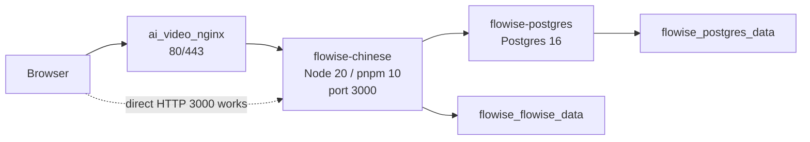

# Flowise 中文生产环境对抗式审计

## 审计后整改状态

本报告正文保留 2026-07-10 首次 read-only 审计时的历史基线，不应当作当前生产状态。当前状态与执行证据以 `.kiro/plan/findings.md`、`.kiro/plan/task_plan.md` 和 `docs/superpowers/plans/2026-07-12-flowise-release-foundation.md` 为准。

2026-07-10 已授权 L4 完成：Node 24 镜像上线、应用端口改为私有 reverse-proxy bridge bind、GET `/auth/resolve` 改为 405、`/register` 重定向、认证页移动布局、Google Fonts/Rewardful console 错误、AppleDouble 污染、启动日志噪音，以及 Nginx/app 重复安全头所有权。

2026-07-12 本地 source/config 完成：Task 4 commit `b73a3c8` 的 Provider tests `225/225`；Task 5 commit `1372561` 的 server `127/127`、UI `65/65`、static security `52/52`；Task 6 commit `699b59b` 的 release tests `18/18`、static security `95/95` 与 clean-clone frozen install。Task 4/5/6 均未由 Stage 0 部署。

仍未完成：登录后核心产品 E2E、SMTP 忘记密码业务结果、Deepseek/Kimi 真实 sandbox 与 reasoning 链路、CSP 生产 report-only 观测及 enforcement 晋级、runtime image/主 bundle 瘦身、About 外联策略、i18n/upstream 治理和 restore drill。Release manifest source/config contract 已完成，但 Docker registry metadata `EOF` 在 Dockerfile evaluation 前阻塞实际 image/archive manifest。

July 12 public L3 (`2026-07-12T10:48:40Z`) 与 SSH L3 (`2026-07-12T10:51:01Z`) 一致确认：当前链路为 `Browser -> ai_video_nginx:443 -> 172.20.0.1:3000 -> Flowise Node 24 -> PostgreSQL`；公网 3000 HTTP `000`、TCP refused；edge smoke `14/14`，HSTS、XFO、XCTO、Referrer-Policy 与 CSP 各 1 个。Flowise healthy、restart `0`、Node `v24.18.0`。

生产仍运行 July 10 `linux/amd64` image `sha256:3c66e08b50562ab856328d669b611d000ccee6c9467f1560b7b8b4ba0b86fad9`，config reference 为 legacy `flowise-chinese:latest`，RepoDigests 与 OCI provenance labels 为空。它不是 Task 6 产生的 immutable artifact。`backup_state=exists_not_checksum_or_restore_verified`。

### 当前未完成任务与批次

| 批次                            | 当前状态                         | 对抗性完成标准                                                                                                                                                  |
| ------------------------------- | -------------------------------- | --------------------------------------------------------------------------------------------------------------------------------------------------------------- |
| Batch 4 认证后 E2E              | 受阻                             | 先取得专用测试账号、隔离 workspace 和安全凭证交付路径；再验证 session、chatflow、Agentflow、document store、API key、权限与清理。                               |
| Batch 5A / Task 4 Deepseek/Kimi | source commit 完成，真实调用受阻 | `b73a3c8` 的 credential/mock transport/error/SSRF contract 已审阅；未部署，真实 sandbox 需要单独授权、测试账号和费用边界，当前 `provider_call=false`。          |
| Batch 6B / Task 5 CSP           | source commit 完成，生产待授权   | `1372561` 的 fail-fast CSP/report contract 已审阅；July 12 生产仍无 CSP Report-Only/Reporting-Endpoints，现行 CSP 含 `unsafe-eval`。                            |
| Batch 7A / Task 6 可复现性      | source/config 完成，Docker 阻塞  | release/dirty-source manifest contract 已审阅；没有 candidate image、archive 或 actual manifest。upstream checklist、文档归档与 backup restore drill 仍待执行。 |
| Batch 7B 性能/攻击面            | 待执行                           | 镜像和主 bundle 有 before/after；runtime 工具移除后节点运行矩阵通过；About 不再无策略外联。                                                                     |

## 0. 结论摘要

首次审计时，本项目不是一个稳定分叉上的小改版，而是与 upstream `FlowiseAI/Flowise` 当时 `main` 同 SHA 对齐、但本地工作区叠加了大量未提交改动的生产复刻版。核心产品逻辑仍是 Flowise：React/Vite 前端、Express API、Flowise node pool、PostgreSQL 持久化、聊天流/Agentflow/工具/凭证/工作区/变量/文档库/执行记录等模块。该历史判断已被 July 12 的 12 个原子 commits 取代；生产仍运行 July 10 image，不能据此声称新 source commits 已部署。

首次审计最需要先处理的不是功能扩展，而是生产边界和工程可复现性：

-   P0: 生产容器 `3000` 端口实测公网可直接访问，`http://101.34.52.232:3000/api/v1/ping` 返回 `200 pong`。这绕过了 HTTPS/Nginx 入口层。
-   P0: 生产镜像运行 Node `v20.20.2`，但 repo `package.json` 和 `packages/server/package.json` 声明 `node: ^24`，启动日志已有 engine warning。
-   P0: 登录页生产可渲染，但 CSP 实测阻断 Google Fonts 与 Rewardful；`/register` 在 open source 模式展示可提交表单，但 UI submit 对 open source 分支没有实际注册逻辑。
-   P1: `GET /api/v1/auth/resolve` 实测返回 `500` 与内部错误信息，不是 404/405 或可控错误。
-   P1: public prediction 预检输入非法 UUID 时会在服务端日志打印 stack，外部未授权请求可制造错误噪音。
-   P1: 镜像包含 macOS AppleDouble `._*` 文件，生产启动日志出现 `Permission denied`。
-   P1: 生产安全头同时由 app 和 Nginx 写入，CSP `frame-ancestors self` 与代码默认 `'self'` 不一致，职责边界混乱。

首次审计阶段没有进行登录、创建账号、创建 flow、调用 Deepseek/Kimi/OpenAI provider、数据库写入、生产变更或 deploy。下面的原始发现保留为历史 read-only 基线；整改后的当前状态以前述状态段、`.kiro/plan/findings.md` 与 `.kiro/plan/task_plan.md` 为准。

## 1. 证据边界

### 2026-07-10 首次审计已验证事实（历史）

-   首次审计工作目录 `/Users/pray/project/FlowAgentic` 不是 git repo，实际 repo 是 `/Users/pray/project/FlowAgentic/flowise`。
-   2026-07-10 首次审计时 `flowise` 分支为 `main...origin/main`，工作区存在大量非本轮产生的修改与未跟踪文件。
-   `origin` 指向 `https://github.com/zjgulai/Flowise.git`，`upstream` 指向 `https://github.com/FlowiseAI/Flowise.git`。
-   经 July 12 修正，首次审计的 base SHA 为 `bb773ffa710bd22639c4ba2643413a0ea2b679d3`，提交标题为 `Fix Flowise 722 node load method workspace (#6593)`；原报告中的另一完整 SHA 是转录错误。
-   codegraph 已初始化：`nodes=16502`，`edges=44205`，主包为 `components`、`ui`、`server`、`agentflow`、`observe`。
-   生产 URL `https://flowise.lute-tlz-dddd.top/` 返回 Flowise HTML，title 为 `Flowise - AI 流程编排平台`。
-   `POST https://flowise.lute-tlz-dddd.top/api/v1/auth/resolve` 返回 `{"redirectUrl":"/signin"}`。
-   `GET https://flowise.lute-tlz-dddd.top/api/v1/auth/resolve` 返回 `500`，body 包含 `Cannot read properties of undefined (reading 'isOrganizationAdmin')`。
-   `https://flowise.lute-tlz-dddd.top/api/v1/ping` 返回 `pong`。
-   `http://flowise.lute-tlz-dddd.top/` 返回 301 到 HTTPS。
-   直连 `http://101.34.52.232:3000/api/v1/ping` 返回 `200 pong`。
-   Playwright 未登录检查显示 `/signin` 登录页、`/forgot-password`、`/register` 均可渲染。
-   Playwright console 显示 CSP 阻断 `https://fonts.googleapis.com/...` 与 `https://r.wdfl.co/rw.js`。
-   生产远端 Docker：`flowise-chinese` 运行 `flowise-chinese:latest`，health `healthy`，映射 `0.0.0.0:3000->3000`；`flowise-postgres` 绑定 `127.0.0.1:5432->5432`。
-   生产远端容器内：Node `v20.20.2`，pnpm `10.26.0`，进程用户 `node`，数据目录 `/usr/src/flowise/.flowise` 可写。
-   生产 Nginx：`flowise.lute-tlz-dddd.top` HTTPS 反代到 `http://flowise_app`，同时设置 HSTS、X-Frame-Options、X-Content-Type-Options、Referrer-Policy。

### 2026-07-10 首次审计未验证项（历史）

-   未使用真实账号登录，未验证登录后画布、凭证、工作区、执行记录、文档库、工具调用等完整交互。
-   未创建、修改或删除任何生产数据。
-   未调用 Deepseek、Kimi、OpenAI 或其他模型 provider。
-   未执行生产数据库查询。
-   未执行 build、deploy、restart 或镜像替换。
-   未确认云安全组/防火墙规则，只验证了公网 HTTP 直连 `3000` 可访问。

## 2. 产品与架构理解

### 上游 Flowise 产品逻辑

Flowise 是可视化 LLM 编排平台，核心抽象是：

-   Chatflow: 通过节点图编排模型、prompt、memory、retriever、tools、vector store、document loader 等。
-   Agentflow: 面向更复杂 agent 步骤、执行历史、节点运行详情。
-   Nodes/Credentials: 每类外部模型、工具、数据库、向量库以 node 和 credential 形式暴露给画布。
-   Runtime/API: 后端加载 node pool，提供预测、流式响应、文件上传、执行、变量、apikey、MCP、文档库等 API。
-   Auth/Workspace: Open source/enterprise/cloud 分支共享部分账号、组织、工作区、角色逻辑。

codegraph 热点显示，当前耦合最高区域是：

-   `components`: 各类节点、credentials、model loader、工具函数。
-   `server`: Express API、auth/session、node pool、chatflow/runtime、domain validation。
-   `ui`: 画布、节点配置、认证页面、数据表、弹窗、中文 hard-coded 文案。

### 本项目复刻与微调

本地改动主要集中在：

-   中文化：大量 UI 文案直接改为中文，另有 `TRANSLATION_AUDIT.md` 指出 `translations.json` 未接入运行时 i18n。
-   模型节点：新增 Kimi/Moonshot chat model；Deepseek 增加 `basepath` 和 `baseOptions`。
-   生产部署：新增或修改 `Dockerfile`、`docker-compose.prod.yml`、`.env.production.template`、腾讯云部署文档。
-   安全边界：修改 secure cookie、CORS、iframe/CSP、生产安全头。
-   测试/报告：根目录存在多份审计、验收、测试、部署报告，但有互相矛盾或过期内容。

这意味着当前风险不是“上游 Flowise 是否可用”，而是“本地生产化 diff 是否可复现、可验证、可长期维护”。

## 3. 部署架构

### 首次审计时生产链路（历史）



### 架构判断

-   Nginx 是预期公网入口，但 Flowise 容器端口也暴露到公网。
-   Postgres host bind 是 `127.0.0.1:5432`，这个边界比 Flowise 应用端口更好。
-   Flowise、Nginx 与服务器上多个其它应用共用同一主机与 Nginx 容器，存在共享入口层和运维耦合。
-   当前单实例运行时 `ScheduleBeat` 日志提示非 queue mode 无 distributed locking；单副本可接受，多副本/HA 前必须处理 queue/lock。

## 4. 对抗式功能与交互审计（首次基线）

| 区域          | 当前观察                                              | 脆弱点                                                                    | 优先级 |
| ------------- | ----------------------------------------------------- | ------------------------------------------------------------------------- | ------ |
| 登录入口      | `/signin` 可渲染，`POST /auth/resolve` 返回 `/signin` | 未做登录后验证；cookie/session 仍需完整 E2E                               | P1     |
| 注册入口      | `/register` 在 open source 模式展示表单               | UI `register()` 只处理 enterprise/cloud，open source submit 无实际分支    | P0     |
| 忘记密码      | 页面可渲染                                            | SMTP 未验证；如果未配置，应给明确产品反馈                                 | P2     |
| 生产 URL      | HTTPS 可访问，HTTP 域名跳转 HTTPS                     | IP:3000 可绕过 Nginx/TLS                                                  | P0     |
| 安全头        | app 与 Nginx 均设置部分 header                        | 重复 header、CSP syntax/config 不一致、仍有 `unsafe-inline`/`unsafe-eval` | P1     |
| CSP 外部资源  | Google Fonts、Rewardful 被 CSP 阻断                   | 控制台错误；隐私/离线策略不清；注册页仍有 `data-rewardful`                | P1     |
| CORS          | 恶意 Origin 登录 preflight 未返回 allow headers       | public prediction 非法 UUID 会打 error stack                              | P1     |
| Provider 节点 | Deepseek/Kimi 节点存在                                | 未授权 provider call，未验证真实调用；base URL 可配置需要边界             | P1     |
| 画布/节点编辑 | 未登录未验证                                          | 主产品核心交互仍缺生产 E2E 证据                                           | P1     |
| 文档库/上传   | 未登录未验证                                          | 文件大小、Chromium、存储、权限需专项 smoke                                | P1     |
| 执行记录/日志 | 未登录未验证                                          | 需要确认中文化不破坏 execution detail 和 node trace                       | P2     |
| 工作区/角色   | 未登录未验证                                          | open source/enterprise/cloud 分支易混淆                                   | P1     |
| About/版本    | `/api/v1/version` 为 `3.1.3`                          | About dialog 会请求 GitHub latest release，生产离线/隐私策略不清          | P2     |

## 5. 关键问题清单

### P0-1. 生产应用端口公网直连

事实：

-   `docker-compose.prod.yml:19-20` 配置 `3000:3000`。
-   生产 Docker inspect 显示 `0.0.0.0:3000->3000`。
-   实测 `curl http://101.34.52.232:3000/api/v1/ping` 返回 `200 pong`。

风险：

-   客户端可绕过 HTTPS 域名入口、Nginx 统一 header、Nginx access policy 和潜在 WAF/rate limit。
-   应用层虽返回部分安全头，但不是完整入口层等价替代。

优化：

-   如果 Nginx 与 Flowise 在同一 Docker network：去掉 host `ports`，改为 internal network 暴露。
-   如果必须 host bind：改为 `127.0.0.1:3000:3000`，并确认 Nginx 仍可访问。
-   同步云安全组/ufw：拒绝公网 `3000/tcp`。

验收：

-   `curl -m 5 http://101.34.52.232:3000/api/v1/ping` 失败或不可达。
-   `curl https://flowise.lute-tlz-dddd.top/api/v1/ping` 仍返回 `pong`。
-   `docker ps` 不再显示 `0.0.0.0:3000->3000`。

### P0-2. Node runtime 与 upstream engine 不一致

事实：

-   `package.json:99-101` 声明 `node: ^24`，`pnpm: ^10.26.0`。
-   `packages/server/package.json` 也声明 server 运行 Node `^24`。
-   `Dockerfile:14` 和 `Dockerfile:65` 使用 `node:20-alpine`。
-   生产容器内 `node -v` 为 `v20.20.2`。
-   生产日志存在 `Unsupported engine: wanted {"node":"^24"} current {"node":"v20.20.2","pnpm":"10.26.0"}`。

风险：

-   上游后续代码可能使用 Node 24 行为，Node 20 通过 `engine-strict=false` 只是隐藏失败。
-   native module build 问题容易反复出现，已有历史 blocker 包括 `sqlite3`、`node-gyp`、`distutils`、`@uiw/react-codemirror`。

优化：

-   首选：所有 Dockerfile、CI、部署镜像统一到 Node 24，并记录一次完整 `pnpm install --frozen-lockfile`、`pnpm build:docker`、容器启动证据。
-   备选：如果必须 Node 20，写 ADR 明确偏离 upstream 的原因、风险和测试矩阵，并消除启动 warning。

验收：

-   生产容器内 `node -v` 与 repo engine 一致。
-   启动日志无 Node engine warning。
-   `pnpm build:docker` 以 frozen lockfile 通过。

### P0-3. 注册页存在 open source 死交互

事实：

-   Playwright 未登录生产检查显示 `/register` 页面可访问并显示“创建账户”按钮。
-   `packages/ui/src/views/auth/register.jsx:124-177` 的 `register()` 只处理 `isEnterpriseLicensed` 与 `isCloud`。
-   同文件 `register.jsx:68` 读取了 `isOpenSource`，但 submit 分支没有 open source 注册逻辑。
-   后端 open source 注册服务存在，但限制单 organization；UI 当前没有清晰承接。

风险：

-   用户可见按钮点击后无有效行为或无明确错误，属于高优先级产品完整性缺陷。
-   如果后续补上 open source 注册，要避免已初始化实例被重复注册。

优化：

-   明确产品策略：
    -   已完成首次 setup 后：`/register` 重定向 `/signin` 或展示“实例已初始化，请由管理员邀请”。
    -   未完成 setup 时：使用专门 setup flow，而不是普通 register flow。
-   增加 E2E：open source initialized 状态下 `/register` 不展示可提交注册表单。

验收：

-   open source 生产实例访问 `/register` 不再出现无效 submit。
-   自动化覆盖 open source、cloud、enterprise 三种分支。

### P1-1. `GET /api/v1/auth/resolve` 返回 500

事实：

-   `POST /api/v1/auth/resolve` 返回正常 redirect JSON。
-   `GET /api/v1/auth/resolve` 返回 `500`，message 为 `Cannot read properties of undefined (reading 'isOrganizationAdmin')`。
-   `packages/server/src/utils/constants.ts:27` 将 `/api/v1/auth/resolve` 放在 public whitelist。

风险：

-   未授权 GET 即可触发 500，暴露内部字段名，污染错误率。
-   这类 method boundary 问题通常意味着 route/middleware 对 `req.user` 或 request shape 假设过强。

优化：

-   对 auth resolve route 明确限制 method；非 POST 返回 404/405。
-   中间件不要在未认证 public route 上假设 `req.user`。
-   增加 API contract test：GET 返回 405/404 且 body 不包含内部 property 名。

### P1-2. CSP 与静态资源策略冲突

事实：

-   `packages/ui/index.html:39-54` 仍加载 Google Fonts 与 Rewardful。
-   生产 CSP 为 `script-src 'self' 'unsafe-inline' 'unsafe-eval'`、`style-src 'self' 'unsafe-inline'`，不允许上述外部域。
-   Playwright console 实测两个资源被 CSP 阻断。

风险：

-   控制台长期报错，降低前端错误信号质量。
-   Rewardful 属于营销/归因脚本，自托管企业产品中默认加载不合适。
-   Google Fonts 外部请求与离线/国内可用性目标冲突。

优化：

-   自托管版本删除 Rewardful bootstrap 与 script。
-   字体改为本地字体或系统字体；如必须外链，需产品/隐私批准并显式 CSP whitelist。
-   增加未登录首页 console error smoke。

验收：

-   Playwright 打开 `/signin`，console 无 CSP blocked resource。
-   `packages/ui/index.html` 不再包含不需要的第三方脚本。

### P1-3. public prediction 非法输入制造服务端 stack 日志

事实：

-   `OPTIONS /api/v1/prediction/abc` 不返回 CORS allow headers。
-   生产日志记录 `Invalid chatflowId format - must be a valid UUID` stack。
-   `packages/server/src/utils/XSS.ts:128-145` 对 public chatflow/TTS request 调用 `validateChatflowDomain`，catch 后 `console.error('Domain validation error:', error)`。

风险：

-   未授权外部请求可持续制造 error stack，影响监控、告警和日志成本。
-   CORS 预检阶段不应走重 DB/业务验证或打印异常 stack。

优化：

-   对 chatflowId 先做 cheap UUID validation；非法 ID 直接 deny，不进入 domain validation。
-   将这类预期非法输入降级为 debug/warn，不打印 stack。
-   增加 CORS preflight regression test。

### P1-4. Docker image 污染与启动噪音

事实：

-   `.dockerignore:1-13` 未忽略 `.DS_Store`、`._*`。
-   生产启动日志出现 `find: /usr/src/flowise/._... Permission denied`。

风险：

-   构建上下文包含 macOS 元数据，降低可复现性。
-   权限噪音掩盖真正启动错误。

优化：

-   `.dockerignore` 增加 `.DS_Store`、`._*`、`__MACOSX/`。
-   部署打包/rsync 使用排除规则。

验收：

-   新镜像内 `find /usr/src/flowise -name '._*' -o -name '.DS_Store'` 无结果。
-   生产启动日志无 AppleDouble permission denied。

### P1-5. 安全头职责混乱

事实：

-   app 在 `packages/server/src/index.ts:214-275` 设置 HSTS、X-Content-Type-Options、Referrer-Policy、CSP。
-   Nginx 同时设置 HSTS、X-Frame-Options、X-Content-Type-Options、Referrer-Policy。
-   响应中可见重复 header。
-   `docker-compose.prod.yml:57` 默认 `IFRAME_ORIGINS=${IFRAME_ORIGINS:-self}`，而代码 `getAllowedIframeOrigins()` 默认是 `"'self'"`；生产响应显示 `frame-ancestors self`。

风险：

-   header owner 不清导致后续 CSP/iframe 变更难审计。
-   `self` 与 CSP keyword `'self'` 不一致，存在配置 hygiene 问题。

优化：

-   选择单一 owner：推荐 Nginx 负责边缘安全头，app 只负责业务必要 CSP 或反过来，但不要重复。
-   `IFRAME_ORIGINS` 使用标准 CSP value，例如 `'self'`，并在配置校验中 fail fast。
-   保留一份 header contract test。

## 6. 技术债务

-   运行时版本债：Node 20/24 混用，engine warning 被容忍。
-   镜像债：runtime stage 仍安装 `make`、`g++`、`build-base`、`cairo-dev`、`pango-dev`、`git`，镜像体积生产实测约 3.27GB。
-   前端 bundle 债：生产主 JS 资产 `index-C_xQMzb-.js` 实测 `5,748,477` bytes，未登录页也加载大 bundle。
-   安全债：CSP 仍包含 `unsafe-inline`、`unsafe-eval`；第三方资源策略未清理。
-   i18n 债：中文化大量 hard-coded，缺少统一词条、回退与 upstream merge 策略。
-   provider 节点债：Kimi/Deepseek 自定义节点缺少单元测试、node load test、mock provider contract test。
-   auth 分支债：open source / cloud / enterprise 注册流程耦合，UI 与后端能力不一致。
-   public API 债：whitelist 面较大，需要基于 method、auth、CORS、error body 做 contract 回归。

## 7. 工程债务

-   当前 repo 工作区有大量未提交修改和未跟踪根目录报告，不利于判断生产镜像对应哪一组源码。
-   多份报告互相矛盾：有的说是 copied not forked，有的说 production ready；但当前 git remote 和生产实测显示需要重新校准。
-   `Dockerfile` 注释说 runtime 不含编译工具链，但实际 runtime 仍安装编译工具链。
-   `Dockerfile:54` 使用 `pnpm install --frozen-lockfile || pnpm install`，可复现构建被 fallback 破坏。
-   `docker-compose.prod.yml` 对 `APP_URL` 有 localhost default，对 secrets/password 为空没有 fail-fast。
-   生产与本地 Docker 状态不一致：本地容器无 health，生产 compose 有 health；文档没有清晰区分。
-   单服务器多应用共享 Nginx，缺少 Flowise 专属 deploy/runbook/rollback 证据链。

## 8. 文档债务

-   根目录报告过多，状态和时间线混乱，应收敛为一个当前 source of truth。
-   `TRANSLATION_AUDIT.md` 指出 translations 未接入，但中文化已大量 hard-code；需要明确长期 i18n 策略。
-   `FINAL_SPRINT_REPORT.md` 一类文档的“完成”措辞需要改为按证据分层：build、image、container、login、production route、provider call 分开。
-   生产 runbook 缺少：
    -   端口/防火墙基线。
    -   env 必填项 preflight。
    -   deploy 前后 smoke checklist。
    -   rollback 方法。
    -   provider call 授权边界。
    -   数据库备份/恢复演练。

## 9. 优化方案

### 阶段 A: 先收紧生产边界

目标：不改产品功能，先让生产入口、runtime、日志和基础交互不继续泄漏风险。

必须完成：

-   关闭公网直连 `3000`。
-   统一 Node runtime。
-   清理 CSP 阻断资源。
-   修复 `/register` 死交互。
-   修复 `GET /auth/resolve` 500。
-   消除非法 prediction preflight stack。
-   清理 AppleDouble 文件。

### 阶段 B: 建立可复现部署链

目标：让本地源码、镜像、服务器运行状态可追溯。

必须完成：

-   冻结一条 production build 命令，不允许 `--frozen-lockfile` fallback。
-   记录 image digest、git SHA、build time、env key checklist。
-   增加 deploy preflight：required env、port binding、Node version、health endpoint。
-   添加 rollback runbook。

### 阶段 C: 补齐产品核心 E2E

目标：验证 Flowise 核心功能与中文化/自定义 provider 没有破坏主路径。

必须覆盖：

-   登录/session persist/logout。
-   创建 chatflow、添加节点、保存、重新打开。
-   Deepseek/Kimi 节点 load methods 与 credential UI，不做真实 provider call；真实 call 另需授权。
-   文档上传与 document store 基本流程。
-   API key 创建/删除。
-   公开 prediction 的 CORS/domain allowlist。
-   工作区/用户/角色入口按 open source 产品策略隐藏或可用。

### 阶段 D: 降低长期维护债

目标：把“复刻微调”变成可维护 fork。

必须完成：

-   中文化从 hard-coded diff 迁移到词条/适配层或明确保留 hard fork 策略。
-   自定义节点加测试和文档。
-   清理根目录历史报告，归档过期报告。
-   建立 upstream rebase/merge checklist。

## 10. 首次审计 TODO List（历史基线）

本节保留最初未勾选状态以追溯发现来源，不代表当前完成度。当前执行状态只维护在 `.kiro/plan/task_plan.md`。

### P0

-   [ ] 将 `docker-compose.prod.yml` 中 Flowise 端口从 `3000:3000` 改为内部网络或 `127.0.0.1:3000:3000`。
-   [ ] 配置云安全组/ufw 禁止公网访问 `3000/tcp`。
-   [ ] 验证直连 `http://101.34.52.232:3000/api/v1/ping` 不可达，域名 HTTPS `/api/v1/ping` 仍可达。
-   [ ] 将生产 Docker builder/runtime 统一到 repo engine Node 24，或形成 Node 20 偏离 ADR 并消除 warning。
-   [ ] 重新构建镜像，记录 git SHA、image id/digest、Node/pnpm 版本和健康检查。
-   [ ] 修复 open source `/register`：已初始化实例不展示可提交注册表单。
-   [ ] 删除或本地化 Google Fonts 与 Rewardful；未批准前不要在自托管生产加载外部营销脚本。

### P1

-   [ ] 修复 `GET /api/v1/auth/resolve` 返回 500，改为 404/405 或可控响应。
-   [ ] 为 auth resolve 增加 method contract test。
-   [ ] public prediction/TTS CORS 预检先做 UUID/body shape cheap validation，非法输入不打印 stack。
-   [ ] `.dockerignore` 增加 `.DS_Store`、`._*`、`__MACOSX/`，部署打包同步排除。
-   [ ] 明确 app 与 Nginx 的 security header owner，移除重复 header。
-   [ ] 将 `IFRAME_ORIGINS` 标准化为 CSP 合法值并 fail fast 校验。
-   [ ] 去掉 `pnpm install --frozen-lockfile || pnpm install` fallback。
-   [ ] 为 `APP_URL`、`CORS_ORIGINS`、JWT secrets、session secret、Postgres password 添加生产 preflight。
-   [ ] 给 Kimi/Deepseek 节点增加 load method test、credential UI smoke、mock provider contract test。
-   [ ] 做一次授权后的登录 E2E，不调用外部 provider。

### P2

-   [ ] 将硬编码中文文案盘点为词条表，决定 i18n 接入或 hard fork 策略。
-   [ ] 前端 bundle 拆分与未登录页轻量化，记录主 bundle before/after。
-   [ ] About dialog 的 GitHub latest release 请求改为可关闭、缓存或自托管版本信息。
-   [ ] SMTP 未配置时，忘记密码页提供明确失败反馈。
-   [ ] 建立 upstream merge checklist，覆盖 package engine、Dockerfile、auth、CORS、custom nodes、i18n。
-   [ ] 整理根目录报告：当前有效报告保留，过期报告归档或标记 superseded。
-   [ ] 补充生产 runbook：deploy、rollback、backup/restore、smoke、provider authorization。

## 11. 建议验收命令

以下命令只作为验收模板，实际执行前按授权边界区分本地、只读、生产变更。

```bash
# 本地静态检查
git status --short --branch
git diff --check
pnpm install --frozen-lockfile
pnpm build:docker

# 生产只读 smoke
curl -fsS https://flowise.lute-tlz-dddd.top/api/v1/ping
curl -fsS -X POST https://flowise.lute-tlz-dddd.top/api/v1/auth/resolve
curl -i https://flowise.lute-tlz-dddd.top/api/v1/auth/resolve
curl -m 5 http://101.34.52.232:3000/api/v1/ping

# 远端只读运行态
docker ps --filter name=flowise
docker inspect flowise-chinese --format '{{json .NetworkSettings.Ports}}'
docker exec flowise-chinese node -v
docker logs --tail=200 flowise-chinese
```

通过标准：

-   direct IP `3000` 不可达。
-   HTTPS 域名健康检查通过。
-   `/auth/resolve` 非 POST 不再 500。
-   登录页 console 无 CSP blocked resource。
-   容器启动日志无 engine warning、AppleDouble permission denied。
-   自定义 provider 节点通过 mock 测试，真实 provider call 仍需人工授权。

## 12. 当前不应做的事

-   不应在未收紧公网端口前继续扩展功能。
-   不应把“页面能打开”写成“产品完整可用”。
-   不应把 Docker image 存在或 health healthy 写成“登录/画布/provider 已验证”。
-   不应在没有授权时调用 Deepseek、Kimi、OpenAI。
-   不应在脏工作区中用 `git add .` 打包所有报告和临时产物。
-   不应继续新增根目录验收报告；后续审计产物应放入 `docs/audits/` 或项目约定目录。
